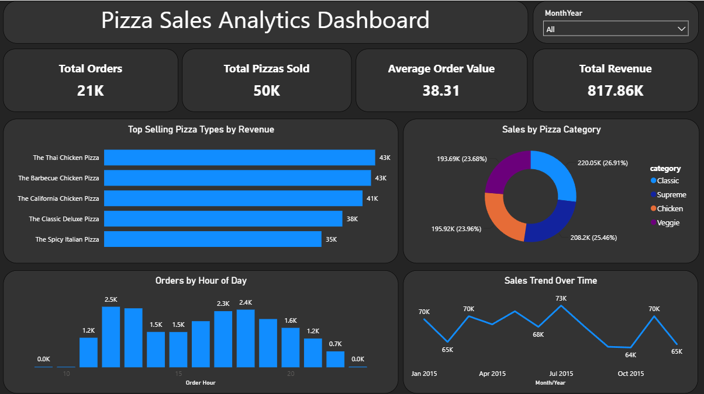

# Power BI Sales Analytics & KPI Reporting Dashboard

## 📊 Project Overview

This project was developed to analyze pizza sales performance and transform raw transactional data into actionable business insights using Power BI.

The dashboard provides visibility into revenue trends, customer ordering behavior, product performance, and operational patterns through interactive visualizations and KPI reporting. The goal was to demonstrate how business intelligence tools can support data-driven decision-making by helping stakeholders quickly identify trends, monitor performance, and uncover opportunities for improvement.

---

## 🎯 Business Problem

Organizations often collect large volumes of transactional data but struggle to convert that information into meaningful insights.

This project addresses that challenge by:

* Consolidating sales data into a centralized reporting solution
* Tracking key business performance indicators (KPIs)
* Identifying top-performing products and categories
* Highlighting customer purchasing patterns
* Providing an intuitive reporting experience for decision-makers

---

## 🛠️ Tools & Technologies

| Tool | Purpose |
|------|---------|
| Power BI | Dashboard Development |
| Power Query | Data Transformation |
| DAX | KPI Calculations |
| Excel | Data Source |
| Data Modeling | Relationship Management |

---

##  📈 Dashboard Features

### Executive Overview

Provides a high-level view of:

* Total Revenue
* Total Orders
* Average Order Value
* Total Pizzas Sold

### Revenue Analysis

Tracks revenue across:

* Pizza Categories
* Product Types
* Sales Trends

### Operational Insights

Identifies:

* Peak Ordering Hours
* Daily Order Patterns
* Sales Distribution Trends

### Interactive Reporting

Users can:

* Filter by category
* Explore performance metrics
* Drill into specific products
* Compare trends across business segments

---

## 💼 Business Impact

This dashboard enables stakeholders to:

- Monitor revenue and sales performance in real time
- Identify top-performing products and categories
- Understand customer ordering behavior
- Support staffing and operational planning during peak periods
- Make data-driven business decisions using interactive reporting

---

## 🔍 Key Findings

### 1. Classic and Supreme Categories Drive Revenue

The Classic and Supreme categories generated more than half of total revenue, contributing approximately 52% of overall sales.

This suggests that maintaining product quality, availability, and marketing focus within these categories is critical to business performance.

### 2. Lunch Hours Represent Peak Demand

Order volume reached its highest levels between 12 PM and 1 PM.

This insight can help support:

* Workforce planning
* Inventory management
* Operational efficiency during peak periods

### 3. Chicken-Based Products Are Top Performers

Thai Chicken, Barbecue Chicken, and California Chicken pizzas generated the highest revenue among all menu items.

These products represent key revenue drivers and may provide opportunities for promotional campaigns and menu optimization.

---

## 🧹 Data Preparation Process

To ensure reliable reporting, the following steps were performed:

* Data cleaning and standardization
* Validation of sales records
* Handling missing and inconsistent values
* Creation of calculated measures and KPIs
* Data modeling and relationship management
* Dashboard testing and verification

---

## 🚀 Future Enhancements

Potential improvements include:

* Automated data refresh through Power BI Service
* Integration with SQL databases
* Real-time reporting capabilities
* Forecasting and trend prediction models
* Advanced customer segmentation analysis

---

## 📂 Repository Contents

- `Pizza_Sales_Analytics_Dashboard.pbix` – Power BI dashboard file
- `dashboard-overview.png` – Dashboard screenshot
- `Business_Insights_and_Dashboard_Enhancement_Plan.pdf` – Findings and future enhancement recommendations
- `README.md` – Project documentation

---

## 📚 What I Learned

This project strengthened my experience in:

* Power BI dashboard development
* KPI reporting and visualization
* Data cleaning and validation
* Business analysis and insight generation
* Communicating findings through data storytelling

The project reinforced the importance of combining technical analysis with business context to create reporting solutions that support informed decision-making.

---

## 👨‍💻 Author

**Afolabi Fagbenro**

Business Analytics | Data Reporting | Power BI | SQL | Data Visualization

LinkedIn: www.linkedin.com/in/afolabifagbenro
GitHub: github.com/afobs10
